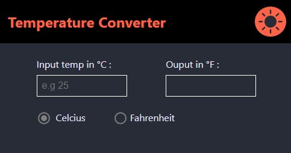

<div id="top"></div>

<br />
<div align="center">
  
<h1 align="center">Temperature Converter</h3>

  <p align="center">
    A web app which lets the user convert between degrees celcius and fahrenheit.
    <br />
    <a href="https://github.com/richardpbCC/temp-converter"><strong>Explore the docs »</strong></a>
    <br />
    <br />
  </p>
</div>

<!-- TABLE OF CONTENTS -->
<details>
  <summary>Table of Contents</summary>
  <ol>
    <li>
      <a href="#about-the-project">About The Project</a>
      <ul>
        <li><a href="#built-with">Built With</a></li>
      </ul>
    </li>
    <li>
      <a href="#getting-started">Getting Started</a>
      <ul>
        <li><a href="#prerequisites">Prerequisites</a></li>
        <li><a href="#installation">Installation</a></li>
        <li><a href="#deployment">Deployment</a></li>
      </ul>
    </li>
    <li><a href="#usage">Usage</a></li>
    <li><a href="#roadmap">Roadmap</a></li>
    <li><a href="#contributing">Contributing</a></li>    
  </ol>
</details>


<!-- ABOUT THE PROJECT -->
## About The Project
<br />
This temperature converter project was designed as a single page web app which allows the user to input a temperature in celcius and get an output in fahrenheit. The user can also toggle the input to fahrenheit to get output in celcius. 

In the future I would like to add additional features including the option to convert from and to degrees kelvin. Please see the <a href=#road-map>Road Map</a> below for a full list of planned features.

This application is deployed on GitHub pages and you can try it out by following this <a href=https://richardpbcc.github.io/temp-converter/>link</a>.  

<br />
<div align="center">
<a href=https://richardpbcc.github.io/temp-converter></a>

</div>

<p align="right">(<a href="#top">back to top</a>)</p>


### Built With

* [React.js](https://reactjs.org/)
* [Node.js](https://nodejs.org/en/)
* [Styled Components](https://styled-components.com/)
* [Rebass](https://github.com/rebassjs/rebass#readme)
* [React Icons](https://github.com/react-icons/react-icons#readme)
<br />

I planned from the start of the project to include a feature for the user to toggle between a light and dark mode theme. For this reason I decided to use the Styled Components UI library from the beginning of the project to make injecting a theme into components more streamlined. 

I also used React Icons for high quality icons for the theme toggle buttons. In addition, I also used the Rebass UI library on top of Styled Components to create a quick and responsive flexbox layout for the page. Rebass served the project well as a lightweight library which worked in combination with Styled Components.

The overall layout of the page was designed to be quite minimalistic with a focus on useability and responsiveness, being intuitive without the need for too many labels or instructions. For example, I decided to have the temperature automatically calculated when entered, without the need for the user to click any additional buttons.

<p align="right">(<a href="#top">back to top</a>)</p>

<!-- GETTING STARTED -->
## Getting Started

To get a local copy up and running follow these simple steps:

### Prerequisites

* npm
  ```sh
  npm install npm@latest -g
  ```

### Installation

1. Clone the repo
   ```sh
   git clone https://github.com/richardpbCC/temp-converter.git
   ```
2. Install NPM packages
   ```sh
   npm install
    ```

### Deployment
Follow the instructions on this <a href=https://github.com/gitname/react-gh-pages>documentation</a> to set up GitHub pages for a React app, then deploy your local repo:  
1. Deploy to GitHub Pages
   ```sh
   npm run deploy
   ```
<p align="right">(<a href="#top">back to top</a>)</p>

<!-- USAGE EXAMPLES -->
## Usage

To use this application enter a temperature in the input box on the left. 

By default the input will be in degrees celcius and automatically output the equivalent temperature in degrees fahrenheit in the output box to the right.

Using the radio buttons below, you can toggle between input types. Click on the fahrenheit radio button to input a temperature in fahrenheit and output in celcius.

Additionally, using the button on the top right of the navbar, you can toggle between a light and a dark mode theme. The theme will be set to light mode by default.


<p align="right">(<a href="#top">back to top</a>)</p>


<!-- ROADMAP -->
<div id = road-map></div>

## Roadmap

  
- Add degrees Kelvin as an option for conversion
- Integrate session storage
- Integrate weather feature
  - Use geolocation to fetch weather data for user location
  - Add feature to search for weather by city
  - Display 3 day forecast
    

See the [open issues](https://github.com/richardpbCC/temp-converter/issues) for a full list of proposed features (and known issues).

<p align="right">(<a href="#top">back to top</a>)</p>


<!-- CONTRIBUTING -->
## Contributing

If you have a suggestion that would make this better, please fork the repo and create a pull request. You can also simply open an issue with the tag "enhancement".
Don't forget to give the project a star! Thanks again!

1. Fork the Project
2. Create your Feature Branch (`git checkout -b feature/AmazingFeature`)
3. Commit your Changes (`git commit -m 'Add some AmazingFeature'`)
4. Push to the Branch (`git push origin feature/AmazingFeature`)
5. Open a Pull Request

<p align="right">(<a href="#top">back to top</a>)</p>
